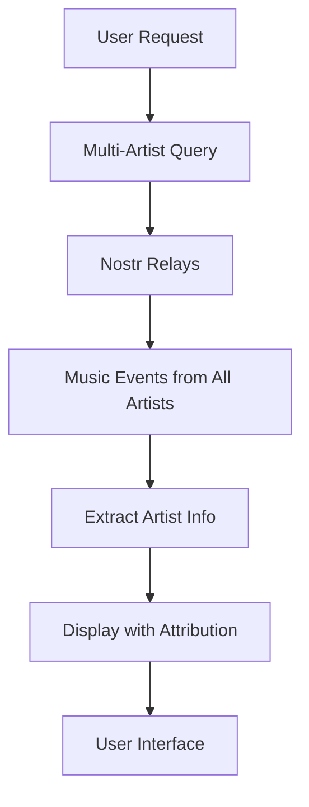

# Design Document

## Overview

This design transforms the Tsunami music application from a single-artist showcase into a multi-artist discovery platform. The system will query Nostr relays for music events from all artists, not just the configured main artist, while maintaining the existing event structure and UI patterns. The design focuses on efficient data fetching, clear artist attribution, and seamless user experience across multiple artists' content.

## Architecture

### Current Architecture
The current system is built around a single configured artist:
- `MUSIC_CONFIG.artistNpub` defines the main artist
- `getArtistPubkeyHex()` returns the configured artist's pubkey
- All music queries filter by `authors: [artistPubkey]`
- UI components assume single-artist context

### New Multi-Artist Architecture
The new architecture expands to support multiple artists:
- **Multi-Artist Data Fetching**: Remove artist filters from Nostr queries
- **Artist Metadata Integration**: Fetch and display basic artist information
- **Simple Artist Attribution**: Show artist names and links on all content

### Data Flow


## Components and Interfaces

### 1. Enhanced useReleases Hook

**Purpose**: Fetch releases from all artists instead of just the configured artist

**Interface**:
```typescript
interface MultiArtistReleaseOptions extends ReleaseSearchOptions {
  artistFilter?: string; // Optional pubkey to filter by specific artist
}

function useReleases(options: MultiArtistReleaseOptions): {
  data: MusicRelease[];
  isLoading: boolean;
  error: Error | null;
}
```

### 2. Simple Artist Components

**ArtistLink Component**:
```typescript
interface ArtistLinkProps {
  pubkey: string;
  showImage?: boolean;
  className?: string;
}

function ArtistLink({ pubkey, showImage = true, className }: ArtistLinkProps)
```

**ArtistFilter Component**:
```typescript
interface ArtistFilterProps {
  selectedArtist?: string;
  onArtistChange: (pubkey: string | undefined) => void;
  availableArtists: string[]; // Just pubkeys
}

function ArtistFilter({ selectedArtist, onArtistChange, availableArtists }: ArtistFilterProps)
```

### 3. Enhanced UI Components

**Enhanced ReleaseCard Component**:
- Add artist name and image display
- Link to artist profile (existing route pattern)
- Maintain existing functionality

**Enhanced ReleaseList Component**:
- Add basic artist filter dropdown
- Show artist name for each release
- Support filtering by artist

## Data Models

### Enhanced MusicRelease Type
```typescript
interface MusicRelease {
  // Existing fields...
  id: string;
  title: string;
  description?: string;
  imageUrl?: string;
  tracks: MusicTrackData[];
  publishDate: Date;
  
  // Artist fields (artistPubkey already exists)
  artistPubkey: string; // Already exists
  artistName?: string; // From profile metadata or fallback
}
```

### Simple Artist Info Type
```typescript
interface SimpleArtistInfo {
  pubkey: string;
  name?: string; // From profile or fallback to npub
  npub: string; // Derived from pubkey
  image?: string; // Profile picture from metadata
}
```

## Data Fetching Strategy

### 1. Simple Multi-Artist Query

**Current Query Pattern**:
```typescript
// Single artist query
const events = await nostr.query([{
  kinds: [MUSIC_KINDS.MUSIC_PLAYLIST],
  authors: [artistPubkey], // Single artist filter
  limit: 50
}]);
```

**New Multi-Artist Query Pattern**:
```typescript
// Multi-artist query - simply remove the authors filter
const events = await nostr.query([{
  kinds: [MUSIC_KINDS.MUSIC_PLAYLIST, MUSIC_KINDS.MUSIC_TRACK],
  // No authors filter - get from all artists
  limit: 100 // Larger limit for more content
}]);
```

### 2. Basic Artist Name Resolution

**Get Artist Names and Images**:
```typescript
// Simple function to get artist display info
function getArtistDisplayInfo(pubkey: string): SimpleArtistInfo {
  const profile = profileCache.get(pubkey);
  return {
    pubkey,
    npub: nip19.npubEncode(pubkey),
    name: profile?.name || profile?.display_name || nip19.npubEncode(pubkey),
    image: profile?.picture
  };
}
```

### 3. Simple Caching

**Basic Cache Structure**:
```typescript
// Simple Map-based cache
const artistInfoCache = new Map<string, SimpleArtistInfo>(); // pubkey -> artist info
const profileCache = new Map<string, ProfileMetadata>(); // pubkey -> profile
```

## Routing and Navigation

### Enhanced Existing Routes

**Homepage**:
```typescript
// Homepage - now shows multi-artist content
/
```

**Releases**:
```typescript
// Releases - now shows all artists with basic filtering
/releases
```

**Artist Profiles**:
```typescript
// Use existing profile route pattern
/:npub -> shows that artist's content only
```

## User Interface Design

### 1. Homepage Enhancements

**Latest Release Section**:
- Show latest release from any artist (not just configured artist)
- Simple artist name display with link
- Fallback to configured artist if no other content

**Recent Releases Grid**:
- Mix of releases from multiple artists
- Artist name and image shown on each card
- Clickable artist names link to profiles

### 2. Release Browsing Enhancements

**Simple Artist Filter**:
- Basic dropdown with artist names
- "All Artists" option (default)
- Filter releases by selected artist

**Release Cards**:
- Artist name and image displayed prominently
- Clickable artist links
- Maintain existing release information

### 3. Artist Profile Pages

**Use Existing Profile Pattern**:
- Leverage existing `/:npub` route
- Show only that artist's releases
- Basic artist information display

## Error Handling

### 1. Artist Discovery Failures

**No Artists Found**:
- Fallback to configured artist if available
- Show helpful message about Nostr relay connectivity
- Provide manual artist addition option

**Partial Artist Data**:
- Graceful degradation when artist metadata is missing
- Use pubkey/npub as fallback display name
- Generic avatar for missing profile pictures

### 2. Performance Degradation

**Slow Queries**:
- Progressive loading with skeleton states
- Timeout handling for artist discovery
- Fallback to cached data when available

**Memory Constraints**:
- Limit concurrent artist data fetching
- Implement cache size limits
- Clear unused data proactively

### 3. Data Consistency

**Stale Artist Data**:
- Background refresh of artist metadata
- Visual indicators for outdated information
- Manual refresh options for users

**Missing Release Data**:
- Handle cases where artist has profile but no music
- Show appropriate empty states
- Suggest exploring other artists

## Testing Strategy

### Unit Tests
- Artist discovery service functionality
- Multi-artist data fetching and caching
- Artist metadata extraction and formatting
- UI component rendering with artist data
- Route handling for artist profiles

### Property-Based Tests
- Artist data consistency across different query patterns
- Cache invalidation and refresh behavior
- UI state management with multiple artists
- Navigation and routing with various artist identifiers

### Integration Tests
- End-to-end artist discovery flow
- Multi-artist release browsing
- Artist profile page functionality
- Performance with large numbers of artists

### Performance Tests
- Query performance with multiple artists
- Memory usage with artist caching
- UI responsiveness with large artist datasets
- Network efficiency of batch queries

## Correctness Properties

*A property is a characteristic or behavior that should hold true across all valid executions of a system-essentially, a formal statement about what the system should do. Properties serve as the bridge between human-readable specifications and machine-verifiable correctness guarantees.*

### Property 1: Multi-Artist Content Discovery
*For any* set of Nostr music events from different artists, the system should display all valid music content without filtering by a specific artist
**Validates: Requirements 1.1, 5.1**

### Property 2: Artist Name and Image Display
*For any* music release or track displayed in the system, the artist name and image (when available) should be shown and clickable
**Validates: Requirements 1.2, 3.1, 7.1**

### Property 3: Artist Filtering Functionality
*For any* artist selection in the filter dropdown, the system should show only that artist's content when selected, or all artists' content when "All Artists" is selected
**Validates: Requirements 1.4, 4.2, 4.3, 4.5**

### Property 4: Artist Profile Navigation
*For any* valid artist npub, navigating to `/:npub` should show only that artist's releases and content
**Validates: Requirements 2.1, 2.3**

### Property 5: Artist Profile Content Display
*For any* artist profile page, basic artist information should be displayed along with their complete discography
**Validates: Requirements 2.2, 2.5**

### Property 6: Multi-Artist Homepage Content
*For any* set of releases from multiple artists, the homepage should display the most recent release from any artist and show releases from different artists
**Validates: Requirements 6.1, 6.4**

### Property 7: Artist Filter UI Presence
*For any* releases browsing interface, a simple artist filter dropdown should be present and populated with discovered artists
**Validates: Requirements 4.1, 3.2**

### Property 8: Release Detail Artist Information
*For any* individual release, artist information should be prominently displayed with links to the artist profile
**Validates: Requirements 3.4**

### Property 9: Artist Name Fallback Behavior
*For any* artist with missing profile information, the system should display the artist's npub as a fallback name
**Validates: Requirements 7.5, 9.3, 9.5**