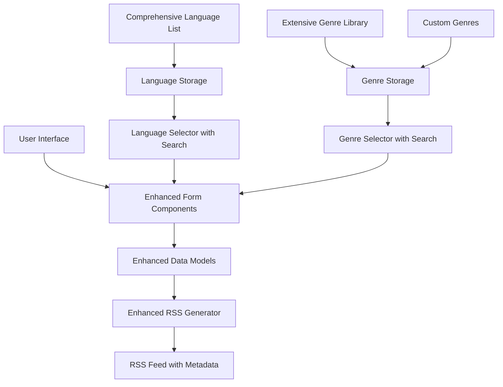

# Design Document: Music Metadata Enhancement

## Overview

The Music Metadata Enhancement system extends the existing music app with comprehensive language support at the track level and genre support at the release level. The system enhances the current data models, RSS generation, and user interface to support these metadata fields with rich language and genre options.

The design focuses on providing comprehensive metadata support with intuitive, well-designed UI components. Language support enables better content discovery for multilingual audiences and proper identification of instrumental tracks, while genre support allows for detailed music categorization and discovery through an extensive genre library.

## Architecture

The system follows an enhancement pattern that extends existing components without breaking changes:



### Data Flow

1. **User Input**: Users select language for tracks and genre for releases through well-designed, searchable UI components
2. **Data Storage**: Enhanced data models store the comprehensive metadata fields
3. **RSS Generation**: Enhanced RSS generator includes language and genre metadata in appropriate RSS elements
4. **Search and Discovery**: Intuitive search interfaces help users quickly find and select appropriate languages and genres

## Components and Interfaces

### Enhanced Data Models

The system extends existing TypeScript interfaces to include the new metadata fields:

```typescript
interface EnhancedReleaseTrack extends ReleaseTrack {
  language?: string; // ISO 639-1 two-letter code (e.g., "en", "es") or null for instrumental
}

interface EnhancedPodcastRelease extends PodcastRelease {
  genre?: string; // Custom genre string (e.g., "punk", "alternative", "EDM")
}
```

### Language Support System

Manages language selection and validation for tracks:

```typescript
interface LanguageSupport {
  getAvailableLanguages(): LanguageOption[];
  validateLanguageCode(code: string): boolean;
  getLanguageName(code: string): string;
}

interface LanguageOption {
  code: string; // ISO 639-1 code
  name: string; // Display name in English
  isInstrumental?: boolean; // Special option for instrumental tracks
}
```

### Genre Management System

Handles genre selection, custom genre creation, and storage:

```typescript
interface GenreManager {
  getCommonGenres(): string[];
  getCustomGenres(): string[];
  addCustomGenre(genre: string): void;
  getAllGenres(): string[];
  validateGenre(genre: string): boolean;
}

interface GenreStorage {
  saveCustomGenre(genre: string): Promise<void>;
  loadCustomGenres(): Promise<string[]>;
  removeCustomGenre(genre: string): Promise<void>;
}
```

### Enhanced RSS Generator

Extends the existing RSS generation to include language and genre metadata:

```typescript
interface EnhancedRSSGenerator extends RSSGenerator {
  generateEnhancedRSS(
    releases: EnhancedPodcastRelease[],
    trailers: PodcastTrailer[],
    config: RSSConfig
  ): string;
  
  addLanguageElements(track: EnhancedReleaseTrack): string;
  addGenreCategories(releases: EnhancedPodcastRelease[]): string;
  formatITunesCategory(genre: string): string;
}
```

### UI Enhancement Components

Provides well-designed, searchable form components for metadata selection:

```typescript
interface LanguageSelector {
  selectedLanguage?: string;
  onLanguageChange: (language: string | null) => void;
  showInstrumentalOption: boolean;
  searchable: boolean;
  placeholder: string;
  maxDisplayItems: number;
}

interface GenreSelector {
  selectedGenre?: string;
  onGenreChange: (genre: string) => void;
  onCustomGenreAdd: (genre: string) => void;
  allowCustomGenres: boolean;
  searchable: boolean;
  placeholder: string;
  maxDisplayItems: number;
  showPopularFirst: boolean;
}

interface SearchableDropdown {
  items: SelectableItem[];
  searchQuery: string;
  onSearchChange: (query: string) => void;
  onItemSelect: (item: SelectableItem) => void;
  filterFunction: (items: SelectableItem[], query: string) => SelectableItem[];
  renderItem: (item: SelectableItem) => ReactNode;
}
```

## Data Models

### Enhanced Track Model

The track model is extended to include optional language support:

```typescript
interface EnhancedReleaseTrack {
  title: string;
  audioUrl: string;
  audioType?: string;
  duration?: number;
  explicit?: boolean;
  language?: string; // New field: ISO 639-1 code or null for instrumental
}
```

**Language Field Specifications**:
- **Type**: Optional string
- **Format**: ISO 639-1 two-letter language codes (e.g., "en", "es", "fr", "de")
- **Null Value**: Represents instrumental tracks or unspecified language
- **Validation**: Must be valid ISO 639-1 code or null
- **Default**: null for new tracks

### Enhanced Release Model

The release model is extended to include optional genre support:

```typescript
interface EnhancedPodcastRelease {
  id: string;
  title: string;
  imageUrl?: string;
  description?: string;
  content?: string;
  tracks: EnhancedReleaseTrack[];
  publishDate: Date;
  tags: string[];
  transcriptUrl?: string;
  guests?: PodcastGuest[];
  externalRefs?: ExternalReference[];
  genre?: string; // New field: Custom genre string
  
  // Existing Nostr-specific fields
  eventId: string;
  artistPubkey: string;
  identifier: string;
  createdAt: Date;
  zapCount?: number;
  totalSats?: number;
  commentCount?: number;
  repostCount?: number;
}
```

**Genre Field Specifications**:
- **Type**: Optional string
- **Format**: Free-form text allowing any genre name
- **Examples**: "punk", "alternative", "pop", "rap", "EDM", "indie rock", "synthwave"
- **Custom Support**: Artists can add new genres not in the predefined list
- **Validation**: Any non-empty string or null
- **Default**: null for new releases

### Language Configuration

Comprehensive language options for the searchable UI selector:

```typescript
interface LanguageConfiguration {
  commonLanguages: LanguageOption[];
  allLanguages: LanguageOption[];
  instrumentalOption: LanguageOption;
}

const COMPREHENSIVE_LANGUAGES: LanguageOption[] = [
  { code: null, name: "None (Instrumental)", isInstrumental: true },
  { code: "en", name: "English" },
  { code: "es", name: "Spanish" },
  { code: "fr", name: "French" },
  { code: "de", name: "German" },
  { code: "it", name: "Italian" },
  { code: "pt", name: "Portuguese" },
  { code: "ru", name: "Russian" },
  { code: "ja", name: "Japanese" },
  { code: "ko", name: "Korean" },
  { code: "zh", name: "Chinese" },
  { code: "ar", name: "Arabic" },
  { code: "hi", name: "Hindi" },
  { code: "th", name: "Thai" },
  { code: "vi", name: "Vietnamese" },
  { code: "tr", name: "Turkish" },
  { code: "pl", name: "Polish" },
  { code: "nl", name: "Dutch" },
  { code: "sv", name: "Swedish" },
  { code: "da", name: "Danish" },
  { code: "no", name: "Norwegian" },
  { code: "fi", name: "Finnish" },
  { code: "cs", name: "Czech" },
  { code: "hu", name: "Hungarian" },
  { code: "ro", name: "Romanian" },
  { code: "bg", name: "Bulgarian" },
  { code: "hr", name: "Croatian" },
  { code: "sk", name: "Slovak" },
  { code: "sl", name: "Slovenian" },
  { code: "et", name: "Estonian" },
  { code: "lv", name: "Latvian" },
  { code: "lt", name: "Lithuanian" },
  { code: "el", name: "Greek" },
  { code: "he", name: "Hebrew" },
  { code: "fa", name: "Persian" },
  { code: "ur", name: "Urdu" },
  { code: "bn", name: "Bengali" },
  { code: "ta", name: "Tamil" },
  { code: "te", name: "Telugu" },
  { code: "ml", name: "Malayalam" },
  { code: "kn", name: "Kannada" },
  { code: "gu", name: "Gujarati" },
  { code: "pa", name: "Punjabi" },
  { code: "mr", name: "Marathi" },
  { code: "ne", name: "Nepali" },
  { code: "si", name: "Sinhala" },
  { code: "my", name: "Burmese" },
  { code: "km", name: "Khmer" },
  { code: "lo", name: "Lao" },
  { code: "ka", name: "Georgian" },
  { code: "am", name: "Amharic" },
  { code: "sw", name: "Swahili" },
  { code: "zu", name: "Zulu" },
  { code: "af", name: "Afrikaans" },
  { code: "is", name: "Icelandic" },
  { code: "ga", name: "Irish" },
  { code: "cy", name: "Welsh" },
  { code: "eu", name: "Basque" },
  { code: "ca", name: "Catalan" },
  { code: "gl", name: "Galician" },
  { code: "mt", name: "Maltese" }
];
```

### Genre Configuration

Extensive genre library with search and custom genre support:

```typescript
interface GenreConfiguration {
  popularGenres: string[];
  allGenres: string[];
  customGenres: string[];
}

const COMPREHENSIVE_GENRES: string[] = [
  // Popular/Common Genres
  "Pop", "Rock", "Hip Hop", "Rap", "R&B", "Country", "Jazz", "Blues", "Classical", "Electronic",
  
  // Electronic/Dance Subgenres
  "EDM", "House", "Techno", "Trance", "Dubstep", "Drum & Bass", "Ambient", "Synthwave", "Chillwave",
  "Future Bass", "Trap", "Hardstyle", "Progressive House", "Deep House", "Tech House", "Minimal",
  
  // Rock Subgenres
  "Alternative Rock", "Indie Rock", "Punk Rock", "Hard Rock", "Metal", "Heavy Metal", "Death Metal",
  "Black Metal", "Progressive Rock", "Psychedelic Rock", "Garage Rock", "Post-Rock", "Shoegaze",
  
  // Hip Hop/Rap Subgenres
  "Old School Hip Hop", "Conscious Rap", "Gangsta Rap", "Trap", "Mumble Rap", "Boom Bap", "Lo-Fi Hip Hop",
  
  // Pop Subgenres
  "Indie Pop", "Synth-pop", "Dream Pop", "Electropop", "K-Pop", "J-Pop", "Bubblegum Pop", "Art Pop",
  
  // Folk/Acoustic
  "Folk", "Indie Folk", "Acoustic", "Singer-Songwriter", "Americana", "Bluegrass", "Celtic",
  
  // World Music
  "World", "Latin", "Reggae", "Ska", "Afrobeat", "Bossa Nova", "Flamenco", "Tango", "Salsa",
  "Cumbia", "Mariachi", "Fado", "Qawwali", "Bhangra", "Gamelan", "Taiko",
  
  // Alternative/Indie
  "Alternative", "Indie", "Experimental", "Avant-garde", "Noise", "Industrial", "Post-Punk",
  "New Wave", "Darkwave", "Coldwave", "Minimal Wave",
  
  // Soul/Funk
  "Soul", "Funk", "Disco", "Motown", "Neo-Soul", "Acid Jazz",
  
  // Reggae/Caribbean
  "Dancehall", "Dub", "Roots Reggae", "Calypso", "Soca",
  
  // Classical Subgenres
  "Baroque", "Romantic", "Contemporary Classical", "Minimalism", "Opera", "Chamber Music",
  
  // Jazz Subgenres
  "Bebop", "Cool Jazz", "Free Jazz", "Fusion", "Smooth Jazz", "Swing", "Big Band",
  
  // Country Subgenres
  "Bluegrass", "Honky Tonk", "Outlaw Country", "Alt-Country", "Country Rock",
  
  // Punk Subgenres
  "Hardcore Punk", "Pop Punk", "Post-Hardcore", "Emo", "Screamo", "Ska Punk",
  
  // Specialty/Niche
  "Chiptune", "Vaporwave", "Lo-Fi", "Field Recording", "Sound Art", "Drone", "Dark Ambient",
  "Breakcore", "Glitch", "IDM", "Downtempo", "Trip Hop", "Acid", "Gabber", "Speedcore",
  
  // Regional/Cultural
  "Afrobeats", "Highlife", "Soukous", "Mbalax", "Rai", "Chaabi", "Gnawa", "Fado", "Sertanejo",
  "Forró", "Axé", "Pagode", "Samba", "Choro", "MPB", "Tropicália", "Nueva Canción", "Bolero"
];

const POPULAR_GENRES: string[] = [
  "Pop", "Rock", "Hip Hop", "Electronic", "R&B", "Country", "Jazz", "Blues", "Classical",
  "Alternative", "Indie", "Punk", "Metal", "Folk", "Reggae", "Soul", "Funk", "EDM", "House", "Techno"
];
```

### RSS Enhancement Data

Data structures for RSS metadata generation:

```typescript
interface RSSLanguageElement {
  trackIndex: number;
  languageCode: string;
  xmlElement: string;
}

interface RSSGenreElement {
  genre: string;
  xmlElement: string;
}

interface EnhancedRSSMetadata {
  languages: RSSLanguageElement[];
  genres: RSSGenreElement[];
  hasLanguageMetadata: boolean;
  hasGenreMetadata: boolean;
}
```

## Correctness Properties

*A property is a characteristic or behavior that should hold true across all valid executions of a system-essentially, a formal statement about what the system should do. Properties serve as the bridge between human-readable specifications and machine-verifiable correctness guarantees.*

### Property 1: Language RSS Generation
*For any* track with a specified language, the generated RSS should include a language element at the item level, and for any track without a specified language, the RSS should omit the language element
**Validates: Requirements 1.3, 1.4, 4.1**

### Property 2: Genre RSS Generation  
*For any* release with a specified genre, the generated RSS should include itunes:category elements at the channel level with "Music" as the primary category and the selected genre as a subcategory
**Validates: Requirements 2.2, 4.2**

### Property 3: Language Code Validation
*For any* language input, the system should accept valid ISO 639-1 two-letter codes and null values, and reject invalid language codes
**Validates: Requirements 1.5, 3.3**

### Property 4: Genre Validation
*For any* genre input, the system should accept any non-empty string value or null values
**Validates: Requirements 3.4**

### Property 5: Multiple Genre Aggregation
*For any* set of releases with different genres, the generated RSS should include all unique genres as separate subcategory elements under the "Music" category
**Validates: Requirements 4.3**

### Property 6: iTunes Category Format Compliance
*For any* genre metadata, the generated RSS should follow the iTunes RSS specification format for category elements
**Validates: Requirements 2.3, 4.4**

### Property 7: RSS Element Preservation
*For any* RSS generation with new metadata, all existing RSS elements should be preserved while adding the new language and genre metadata
**Validates: Requirements 4.5**

### Property 8: Release-Level Genre Association
*For any* release with a genre, the genre should be associated with the release and apply to all tracks within that release
**Validates: Requirements 2.5**

### Property 9: UI Search Functionality
*For any* search query in language or genre selectors, the search should filter results effectively and display relevant matches with proper highlighting and sorting
**Validates: Requirements 5.1, 5.2**

## Error Handling

The system implements comprehensive error handling to ensure robust operation:

### Language Processing Errors
- **Invalid Language Codes**: Log warning and treat as null (instrumental)
- **Malformed Language Data**: Skip invalid entries and continue processing
- **Missing Language Configuration**: Use default language options

### Genre Processing Errors
- **Empty Genre Strings**: Treat as null and omit from RSS
- **Special Characters in Genres**: Properly escape for XML output
- **Custom Genre Storage Failures**: Log error but continue with session-only storage

### RSS Generation Errors
- **Language Element Formatting**: Skip malformed language data and log warning
- **Category Element Formatting**: Use fallback "Music" category if genre formatting fails
- **XML Validation Errors**: Escape problematic characters and retry generation

### UI Component Errors
- **Language Selector Failures**: Show default options and log error
- **Genre Selector Failures**: Show popular genres and disable custom genre addition
- **Search Functionality Errors**: Fall back to showing all options without search
- **Form Validation Errors**: Display user-friendly error messages

### Custom Genre Storage Errors
- **Storage Quota Exceeded**: Warn user and prevent adding more custom genres
- **Storage Access Denied**: Use session-only storage and notify user
- **Duplicate Genre Detection**: Prevent duplicate entries and notify user

## Testing Strategy

The Music Metadata Enhancement system will be tested using a dual approach combining unit tests and property-based tests to ensure comprehensive coverage and correctness.

### Unit Testing Approach
Unit tests will focus on specific examples, edge cases, and UI interactions:

- **UI Component Testing**: Test searchable language and genre selector components with specific inputs
- **Search Functionality**: Test search filtering, highlighting, and sorting with known queries
- **Data Model Validation**: Test specific validation scenarios with known inputs
- **RSS Generation Examples**: Test RSS output with specific language and genre combinations
- **Error Handling**: Test specific error conditions and recovery scenarios
- **Custom Genre Management**: Test adding, storing, and retrieving custom genres

### Property-Based Testing Approach
Property tests will verify universal properties across randomized inputs using **fast-check** for TypeScript:

- **Minimum 100 iterations** per property test to ensure comprehensive coverage
- **Smart generators** that create valid language codes, genre strings, and release data
- **Comprehensive input space coverage** through randomization
- **Universal correctness validation** across all possible inputs

### Property Test Configuration
Each property test will be tagged with a comment referencing its design document property:

```typescript
// Feature: music-metadata-enhancement, Property 1: Language RSS Generation
test('tracks with language include RSS language elements', () => {
  fc.assert(fc.property(
    trackWithLanguageGenerator(),
    (track) => {
      const rss = generateRSSForTrack(track);
      if (track.language) {
        return rss.includes(`<language>${track.language}</language>`);
      } else {
        return !rss.includes('<language>');
      }
    }
  ), { numRuns: 100 });
});
```

### Test Data Management
- **Mock Language Data**: Comprehensive list of valid ISO 639-1 codes for testing
- **Mock Genre Data**: Extensive genre library including popular and niche genres
- **Search Query Fixtures**: Various search patterns for testing search functionality
- **Fixture Releases**: Test releases with various language and genre combinations
- **Error Injection**: Controlled error scenarios for testing error handling
- **UI Interaction Scenarios**: Simulated user interactions with search and selection

### Coverage Requirements
- **Unit test coverage**: Focus on specific examples, UI interactions, search functionality, and edge cases
- **Property test coverage**: Verify universal properties hold for all inputs
- **Integration coverage**: Test complete end-to-end scenarios with comprehensive metadata
- **UI/UX coverage**: Ensure search and selection interfaces work intuitively

The combination of unit and property tests ensures both specific correctness (unit tests) and universal correctness (property tests), providing confidence that the Music Metadata Enhancement system works correctly across all possible inputs and scenarios with well-designed, searchable user interfaces.