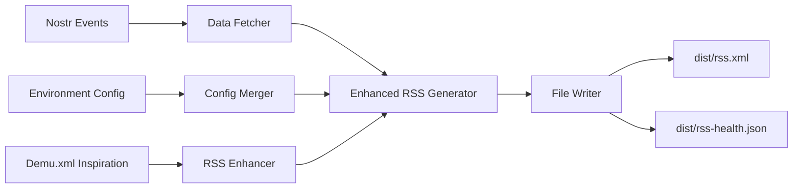

# Design Document: RSS Distribution Builder

## Overview

The RSS Distribution Builder enhances the existing RSS generation system by incorporating best practices and structural elements inspired by the demu.xml template. Rather than parsing the template file directly, the system uses demu.xml as a reference for improving the RSS structure, adding missing elements, and ensuring compatibility with decentralized music platforms while maintaining the current Nostr integration and environment configuration approach.

## Architecture

The system follows an enhancement pipeline architecture with three main stages:



### Data Flow

1. **Structure Analysis**: Analyze demu.xml to identify missing elements and best practices for RSS enhancement
2. **Data Collection**: Fetch podcast releases and trailers from multiple Nostr relays (existing functionality)
3. **Configuration Merging**: Combine environment variables with Nostr metadata (existing functionality)
4. **Enhanced RSS Generation**: Generate RSS XML with improved structure inspired by demu.xml
5. **File Output**: Write RSS feed and health check files to the distribution directory (existing functionality)

## Components and Interfaces

### RSSEnhancer

Responsible for analyzing demu.xml structure and defining enhancements to apply to the existing RSS generator.

```typescript
interface RSSEnhancer {
  getRequiredElements(): RequiredElement[];
  getNamespaceDeclarations(): Record<string, string>;
  getElementOrdering(): ElementOrder[];
  getBestPractices(): BestPractice[];
}

interface RequiredElement {
  tagName: string;
  namespace?: string;
  required: boolean;
  source: 'config' | 'nostr' | 'computed';
}

interface BestPractice {
  description: string;
  implementation: string;
  example: string;
}
```

### EnhancedRSSGenerator

Extends the existing RSS generator with demu.xml inspired improvements.

```typescript
interface EnhancedRSSGenerator extends RSSGenerator {
  generateEnhancedRSS(
    releases: PodcastRelease[],
    trailers: PodcastTrailer[],
    config: FinalConfig,
    enhancements: Enhancement[]
  ): string;
  
  addPodcastPersonTags(config: FinalConfig): string[];
  addTranscriptTags(releases: PodcastRelease[]): string[];
  addEpisodeNumbering(releases: PodcastRelease[]): string[];
  formatDurationTags(releases: PodcastRelease[]): string[];
}
```

### DataFetcher

Handles fetching podcast data from Nostr relays and environment configuration.

```typescript
interface DataFetcher {
  fetchPodcastReleases(artistPubkey: string, relays: string[]): Promise<PodcastRelease[]>;
  fetchPodcastTrailers(artistPubkey: string, relays: string[]): Promise<PodcastTrailer[]>;
  fetchArtistMetadata(artistPubkey: string, relays: string[]): Promise<ArtistMetadata | null>;
}

interface ArtistMetadata {
  name: string;
  description: string;
  image: string;
  website: string;
  value: ValueConfig;
  funding: string[];
}
```

### ConfigMerger

Merges configuration from multiple sources with proper precedence.

```typescript
interface ConfigMerger {
  mergeConfigs(envConfig: EnvironmentConfig, nostrMetadata: ArtistMetadata | null): FinalConfig;
}

interface FinalConfig extends PodcastConfig {
  dataSource: {
    metadata: 'nostr' | 'env';
    releases: 'nostr' | 'none';
    trailers: 'nostr' | 'none';
  };
}
```

### Enhancement

Defines specific improvements to apply to RSS generation based on demu.xml analysis.

```typescript
interface Enhancement {
  type: 'element' | 'attribute' | 'structure' | 'namespace';
  target: string;
  action: 'add' | 'modify' | 'reorder';
  value: string | object;
  condition?: (data: any) => boolean;
}

interface DemuInspiredElements {
  podcastPerson: PersonElement[];
  podcastTranscript: TranscriptElement[];
  podcastEpisode: EpisodeElement[];
  itunesDuration: DurationElement[];
  podcastValue: ValueElement[];
}
```

### FileWriter

Handles writing output files to the distribution directory.

```typescript
interface FileWriter {
  writeRSSFeed(content: string, path: string): Promise<void>;
  writeHealthCheck(metadata: HealthCheckData, path: string): Promise<void>;
  ensureDirectory(path: string): Promise<void>;
}

interface HealthCheckData {
  status: 'ok' | 'error';
  endpoint: string;
  generatedAt: string;
  releaseCount: number;
  trailerCount: number;
  feedSize: number;
  dataSource: FinalConfig['dataSource'];
}
```

## Data Models

### Enhanced RSS Structure

The system enhances the existing RSS generation with elements inspired by demu.xml:

```typescript
interface EnhancedRSSFeed {
  channel: EnhancedChannel;
  items: EnhancedItem[];
}

interface EnhancedChannel {
  // Existing fields from current RSS generator
  title: string;
  description: string;
  link: string;
  
  // Demu-inspired enhancements
  podcastGuid: string;
  podcastMedium: string;
  podcastPerson: PersonElement[];
  podcastValue: ValueElement[];
  podcastLocation?: LocationElement;
  generator: string;
  managingEditor?: string;
  webMaster?: string;
}

interface EnhancedItem {
  // Existing fields from current RSS generator
  title: string;
  description: string;
  enclosure: EnclosureElement;
  
  // Demu-inspired enhancements
  podcastEpisode?: number;
  podcastTranscript?: string;
  itunesDuration?: string;
  podcastPerson?: PersonElement[];
  podcastValue?: ValueElement[];
}
```

## Correctness Properties

*A property is a characteristic or behavior that should hold true across all valid executions of a system-essentially, a formal statement about what the system should do. Properties serve as the bridge between human-readable specifications and machine-verifiable correctness guarantees.*

### Property 1: RSS Structure Enhancement
*For any* generated RSS feed, the output should include all structural elements present in the demu.xml template with proper namespace declarations
**Validates: Requirements 1.1, 1.2, 1.3, 1.4**

### Property 2: Data Fetching Completeness  
*For any* configured set of Nostr relays, the system should successfully fetch all available podcast releases and trailers from at least one relay
**Validates: Requirements 2.1, 2.2**

### Property 3: Configuration Precedence
*For any* conflicting configuration values between Nostr metadata and environment config, the final merged configuration should contain the Nostr value
**Validates: Requirements 2.3, 2.4**

### Property 4: RSS Validity and Completeness
*For any* generated RSS feed, the output should be valid XML containing all required RSS 2.0 elements and Podcasting 2.0 namespace tags
**Validates: Requirements 3.1, 3.2, 3.3**

### Property 5: Content Escaping Safety
*For any* content containing XML special characters, the generated RSS should have all special characters properly escaped
**Validates: Requirements 3.4**

### Property 6: GUID Uniqueness
*For any* RSS feed with multiple items, all item GUIDs should be unique within that feed
**Validates: Requirements 3.5**

### Property 7: File Operations Reliability
*For any* successful RSS generation, the system should create all required output files and handle directory creation gracefully
**Validates: Requirements 4.1, 4.2, 4.3, 4.4, 4.5**

### Property 8: Graceful Degradation
*For any* external service failures (relay timeouts, missing data), the system should continue operation and produce valid output with available data
**Validates: Requirements 5.1, 5.2, 5.3**

### Property 9: Demu-Inspired Element Inclusion
*For any* RSS feed generation with available data, the output should include podcast:person, podcast:transcript, podcast:episode, and itunes:duration tags when corresponding data is available
**Validates: Requirements 6.1, 6.2, 6.3, 6.4, 6.5**

## Error Handling

The system implements comprehensive error handling across all components:

### Template Processing Errors
- **Invalid XML**: Log error and exit with status code 1
- **Missing required elements**: Use fallback values from default template structure
- **Malformed placeholders**: Skip invalid placeholders and log warnings

### Data Fetching Errors
- **Relay connection failures**: Continue with other relays, log warnings
- **Invalid Nostr events**: Skip invalid events, log validation errors
- **Network timeouts**: Use 5-second timeout per relay, continue with available data
- **No data found**: Generate empty but valid RSS feed

### Configuration Errors
- **Missing environment variables**: Use fallback values from demu.xml template
- **Invalid JSON in config**: Log error and use fallback values
- **Type mismatches**: Coerce types where possible, use fallbacks otherwise

### File System Errors
- **Directory creation failures**: Log error and exit with status code 1
- **File write failures**: Log error and exit with status code 1
- **Permission errors**: Log detailed error message and exit with status code 1

### RSS Generation Errors
- **XML serialization failures**: Log error and exit with status code 1
- **Invalid character encoding**: Escape problematic characters and log warnings
- **Missing required elements**: Use fallback values and log warnings

## Testing Strategy

The RSS Distribution Builder will be tested using a dual approach combining unit tests and property-based tests to ensure comprehensive coverage and correctness.

### Unit Testing Approach
Unit tests will focus on specific examples, edge cases, and integration points:

- **Template parsing**: Test parsing of the actual demu.xml file and variations
- **Configuration merging**: Test specific merge scenarios with known inputs
- **Error conditions**: Test specific error scenarios (missing files, invalid XML, network failures)
- **File operations**: Test file creation, directory handling, and permission scenarios
- **Integration points**: Test the complete pipeline with known test data

### Property-Based Testing Approach
Property tests will verify universal properties across randomized inputs using **fast-check** for TypeScript:

- **Minimum 100 iterations** per property test to ensure comprehensive coverage
- **Smart generators** that create valid XML structures, configuration objects, and Nostr events
- **Comprehensive input space coverage** through randomization
- **Universal correctness validation** across all possible inputs

### Property Test Configuration
Each property test will be tagged with a comment referencing its design document property:

```typescript
// Feature: rss-distribution-builder, Property 1: Template Processing Preservation
test('template processing preserves XML structure', () => {
  fc.assert(fc.property(
    xmlTemplateGenerator(),
    (template) => {
      const parsed = parseTemplate(template);
      const regenerated = generateFromTemplate(parsed);
      return xmlStructureEquals(template, regenerated);
    }
  ), { numRuns: 100 });
});
```

### Test Data Management
- **Mock Nostr relays** for consistent testing without external dependencies
- **Fixture templates** based on demu.xml variations for template testing
- **Configuration test cases** covering all environment variable combinations
- **Error injection** for testing failure scenarios

### Coverage Requirements
- **Unit test coverage**: Focus on specific examples and edge cases
- **Property test coverage**: Verify universal properties hold for all inputs
- **Integration coverage**: Test complete end-to-end scenarios
- **Error path coverage**: Ensure all error conditions are properly handled

The combination of unit and property tests ensures both specific correctness (unit tests) and universal correctness (property tests), providing confidence that the RSS Distribution Builder works correctly across all possible inputs and scenarios.