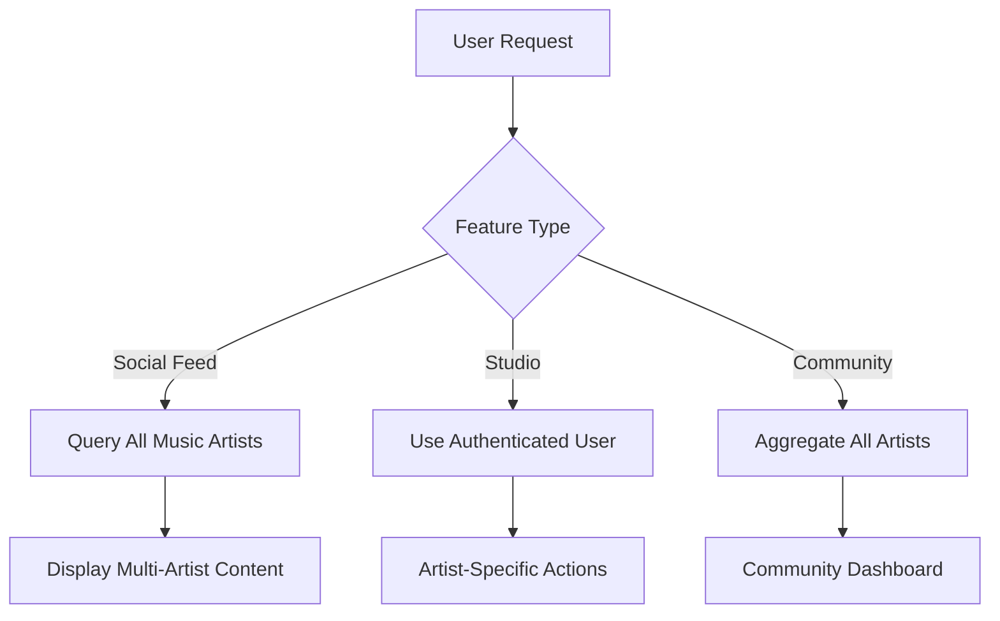

# Design Document

## Overview

This design transforms Tsunami's social and community features from single-artist focused to global multi-artist platform. The key changes involve removing hardcoded artist dependencies, expanding social feeds to include all music artists, and making studio features work for any authenticated artist.

## Architecture

### Current Single-Artist Architecture
- Social feeds query only `MUSIC_CONFIG.artistNpub`
- Community page shows only configured artist's content
- Studio features assume user is the configured artist
- All social interactions tied to single artist identity

### New Multi-Artist Architecture
- Social feeds query all music artists discovered through music events
- Community page aggregates content from entire ecosystem
- Studio features work for any authenticated Nostr user
- Social interactions support any artist in the community

### Data Flow


## Components and Interfaces

### 1. Enhanced Social Feed Hooks

**Multi-Artist Social Posts**:
```typescript
interface CommunityPostsOptions {
  limit?: number;
  artistFilter?: string; // Optional filter for specific artist
}

function useCommunityPosts(options: CommunityPostsOptions): {
  data: NostrEvent[];
  isLoading: boolean;
  fetchNextPage: () => void;
}
```

**Artist Discovery Integration**:
```typescript
function useArtistSocialContent(pubkey: string): {
  posts: NostrEvent[];
  replies: NostrEvent[];
  isLoading: boolean;
}
```

### 2. Artist-Independent Studio Components

**Dynamic Artist Context**:
```typescript
interface StudioContextProps {
  authenticatedArtist: string | null; // Current user's pubkey
  isArtistAuthenticated: boolean;
}

function useStudioContext(): StudioContextProps
```

**Artist Settings Without Config Dependency**:
```typescript
interface ArtistSettingsProps {
  artistPubkey: string; // From authenticated user, not config
}

function ArtistSettings({ artistPubkey }: ArtistSettingsProps)
```

### 3. Community Dashboard Components

**Multi-Artist Activity Feed**:
```typescript
interface CommunityActivityProps {
  showArtistFilter?: boolean;
  defaultFilter?: 'all' | string; // 'all' or specific artist pubkey
}

function CommunityActivity({ showArtistFilter, defaultFilter }: CommunityActivityProps)
```

## Data Models

### Enhanced Social Query Patterns

**Current Single-Artist Query**:
```typescript
// Old: Only configured artist
const posts = await nostr.query([{
  kinds: [1],
  authors: [getArtistPubkeyHex()], // Single artist
  limit: 20
}]);
```

**New Multi-Artist Query**:
```typescript
// New: All music artists
const musicArtists = await discoverMusicArtists(); // From music events
const posts = await nostr.query([{
  kinds: [1],
  authors: musicArtists, // All discovered artists
  limit: 50
}]);
```

### Artist Context Resolution

**Studio Artist Resolution**:
```typescript
function resolveStudioArtist(user: User | null): string | null {
  // Use authenticated user, not config
  return user?.pubkey || null;
}

function isStudioAccessible(user: User | null): boolean {
  // Any authenticated user can access studio
  return !!user?.pubkey;
}
```

## User Interface Design

### 1. Community Page Redesign

**Multi-Artist Timeline**:
- Remove single-artist branding
- Show posts from all music artists
- Add artist attribution to each post
- Include artist filter dropdown

**Community Metrics**:
- Aggregate stats across all artists
- Show top artists by engagement
- Display recent releases from community

### 2. Studio Independence

**Authentication-Based Access**:
- Remove checks for configured artist
- Use authenticated user's identity
- Allow any user to manage their own content

**Artist Settings**:
- Load settings for authenticated user
- Save metadata to user's own events
- Remove dependency on global config

### 3. Social Feed Enhancement

**Artist Attribution**:
- Show artist name and image on all posts
- Link to artist profiles
- Maintain existing interaction patterns

## Implementation Strategy

### Phase 1: Social Feed Multi-Artist Support

1. **Update Social Hooks**:
   - Modify `useArtistPosts` to accept artist parameter
   - Create `useCommunityPosts` for multi-artist content
   - Update query patterns to support multiple artists

2. **Enhance Community Page**:
   - Replace single-artist queries with multi-artist
   - Add artist attribution to all content
   - Update UI to show community-wide activity

### Phase 2: Studio Independence

1. **Remove Config Dependencies**:
   - Update studio components to use authenticated user
   - Remove hardcoded artist checks
   - Make artist settings dynamic

2. **Artist Authentication**:
   - Use current user's pubkey for all studio operations
   - Update permission checks
   - Ensure content ownership is correct

### Phase 3: Branding and UX

1. **Global Platform Messaging**:
   - Update homepage to showcase community
   - Revise navigation and branding
   - Emphasize multi-artist discovery

2. **Artist Discovery**:
   - Integrate with existing multi-artist discovery
   - Surface new artists in social feeds
   - Connect music and social content

## Error Handling

### Artist Discovery Failures
- Graceful fallback when no artists found
- Handle partial artist data
- Maintain functionality with limited social content

### Authentication Issues
- Clear messaging for unauthenticated studio access
- Proper error handling for invalid artist data
- Fallback to read-only mode when appropriate

### Social Content Loading
- Progressive loading for large artist sets
- Timeout handling for slow queries
- Empty state handling for new communities

## Testing Strategy

### Unit Tests
- Multi-artist social query functionality
- Artist authentication and permission checks
- Community aggregation logic
- Studio independence from configuration

### Integration Tests
- End-to-end community page functionality
- Studio workflow for different artists
- Social interaction across multiple artists
- Artist discovery integration

## Correctness Properties

*A property is a characteristic or behavior that should hold true across all valid executions of a system-essentially, a formal statement about what the system should do. Properties serve as the bridge between human-readable specifications and machine-verifiable correctness guarantees.*

### Property 1: Multi-Artist Community Content Display
*For any* set of social posts from different music artists, the community page should display posts from all artists, not just a single configured artist
**Validates: Requirements 1.1**

### Property 2: Artist Attribution Consistency
*For any* social post displayed in the system, the post should include clear and correct artist attribution information
**Validates: Requirements 1.2**

### Property 3: Automatic Artist Discovery
*For any* new artist who publishes music events, their social content should automatically appear in the community feed
**Validates: Requirements 1.3**

### Property 4: Authentication-Based Studio Access
*For any* authenticated user accessing studio features, the system should use their logged-in identity rather than a configured artist identity
**Validates: Requirements 2.1**

### Property 5: Authenticated Content Association
*For any* content published through the studio, the content should be associated with the currently authenticated artist's identity
**Validates: Requirements 2.2**

### Property 6: Independent Profile Management
*For any* authenticated artist, they should be able to update their own profile settings regardless of global configuration
**Validates: Requirements 2.3**

### Property 7: Content Diversity Display
*For any* set of content from multiple artists, the system should showcase content from different artists rather than focusing on a single artist
**Validates: Requirements 3.3**