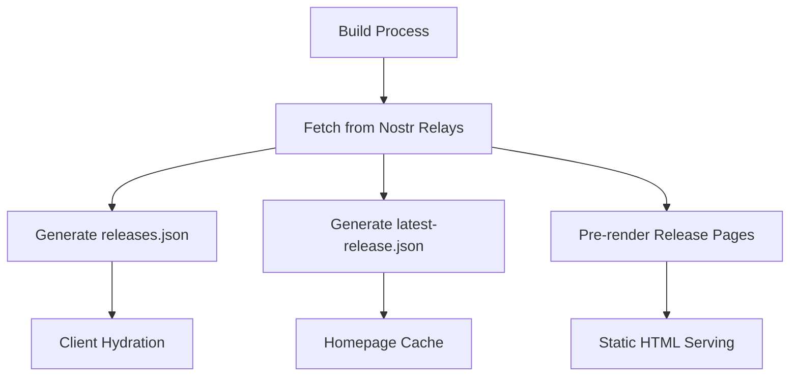

# Design Document: SSR Release Caching

## Overview

This design implements Static Site Generation (SSG) for music releases by extending the existing build process to generate pre-rendered HTML pages and cached JSON data files. The solution leverages the current Nostr data fetching infrastructure from `build-rss.ts` and integrates seamlessly with the existing Vite build pipeline.

The approach focuses on simplicity and performance by generating static assets at build time rather than requiring a server runtime. This aligns with the current deployment model and provides instant loading for release pages while maintaining the existing client-side interactivity.

## Architecture

### Build-Time Data Generation

The SSG process extends the existing `npm run build` command with additional steps:

1. **Vite Build**: Standard React application build
2. **RSS Generation**: Existing RSS feed generation (already implemented)
3. **Release Data Caching**: New step to generate JSON cache files
4. **Page Pre-rendering**: New step to generate static HTML pages

### Data Flow



### File Structure

```
dist/
├── index.html                 # Main app entry
├── rss.xml                   # RSS feed (existing)
├── data/
│   ├── releases.json         # All releases cache
│   ├── latest-release.json   # Latest release cache
│   └── release-[id].json     # Individual release cache
├── releases/
│   ├── index.html           # Releases list page
│   └── [release-id]/
│       └── index.html       # Pre-rendered release pages
└── assets/                   # Vite build assets
```

## Components and Interfaces

### Build Script Extension

**File**: `scripts/build-ssg.ts`

```typescript
interface ReleaseCache {
  releases: MusicRelease[];
  metadata: {
    generatedAt: string;
    totalCount: number;
    dataSource: 'nostr' | 'fallback';
  };
}

interface LatestReleaseCache {
  release: MusicRelease | null;
  metadata: {
    generatedAt: string;
    dataSource: 'nostr' | 'fallback';
  };
}

// Main SSG generation function
async function generateStaticSite(): Promise<void>

// Generate JSON cache files
async function generateReleaseCache(releases: MusicRelease[]): Promise<void>

// Pre-render HTML pages
async function preRenderPages(releases: MusicRelease[]): Promise<void>
```

### Client-Side Cache Integration

**File**: `src/hooks/useStaticReleaseCache.ts`

```typescript
interface StaticCacheHook {
  data: MusicRelease[] | null;
  isLoading: boolean;
  isStale: boolean;
  lastUpdated: Date | null;
}

// Hook to load cached release data with fallback to live data
function useStaticReleaseCache(): StaticCacheHook

// Hook specifically for latest release with cache-first strategy
function useLatestReleaseCache(): StaticCacheHook
```

### Page Pre-rendering

**File**: `src/utils/pageRenderer.ts`

```typescript
interface PageRenderContext {
  release: MusicRelease;
  baseUrl: string;
  assetManifest: Record<string, string>;
}

// Render release page to static HTML
function renderReleasePage(context: PageRenderContext): string

// Generate HTML with proper meta tags and structured data
function generatePageHTML(content: string, meta: PageMeta): string
```

## Data Models

### Cache File Formats

**releases.json**:
```typescript
{
  releases: MusicRelease[];
  metadata: {
    generatedAt: string;        // ISO timestamp
    totalCount: number;         // Total releases found
    dataSource: 'nostr' | 'fallback';
    relaysUsed: string[];      // Relay URLs used
    cacheVersion: string;      // For cache invalidation
  };
}
```

**latest-release.json**:
```typescript
{
  release: MusicRelease | null;
  metadata: {
    generatedAt: string;
    dataSource: 'nostr' | 'fallback';
    relaysUsed: string[];
    cacheVersion: string;
  };
}
```

### Pre-rendered Page Structure

Each pre-rendered HTML page includes:
- Complete release metadata in `<head>` tags
- Structured data (JSON-LD) for SEO
- Initial state for React hydration
- Asset preload hints for critical resources

## Correctness Properties

*A property is a characteristic or behavior that should hold true across all valid executions of a system-essentially, a formal statement about what the system should do. Properties serve as the bridge between human-readable specifications and machine-verifiable correctness guarantees.*

### Property 1: Build Output Completeness
*For any* successful build execution, all required output files (releases.json, latest-release.json, and pre-rendered HTML pages) should be generated in the correct locations with valid structure.
**Validates: Requirements 1.2, 4.5, 6.2**

### Property 2: Data Fetching Consistency  
*For any* build execution, the SSG process should fetch release data using the same Nostr logic as the RSS generation and produce consistent results.
**Validates: Requirements 1.1, 4.2**

### Property 3: Cache Data Completeness
*For any* generated cache file, it should contain complete release data including full track information and all required metadata fields.
**Validates: Requirements 1.3, 1.4, 6.3**

### Property 4: Pre-rendered Content Integrity
*For any* pre-rendered HTML page, it should contain complete release metadata and be ready for React hydration without content loss.
**Validates: Requirements 2.1, 2.2, 5.1**

### Property 5: Fallback Behavior Consistency
*For any* error condition (missing data, failed fetches, missing cache files), the system should provide appropriate fallbacks without breaking functionality.
**Validates: Requirements 1.5, 2.5, 3.4, 5.5**

### Property 6: Client Cache Loading
*For any* cached JSON file, the client-side hooks should correctly load and display the cached data with proper metadata handling.
**Validates: Requirements 3.1, 3.2**

### Property 7: Hydration Preservation
*For any* pre-rendered page, React hydration should preserve the static content and enable interactive features without visual disruption.
**Validates: Requirements 2.4, 5.2**

### Property 8: Cache Refresh Behavior
*For any* stale cached data, the system should trigger background refresh mechanisms and update displays with fresh Nostr data.
**Validates: Requirements 3.3, 5.4**

### Property 9: Build Process Integration
*For any* build execution, the SSG generation should run in the correct sequence after Vite build and output appropriate build statistics.
**Validates: Requirements 4.1, 4.3**

### Property 10: Error Recovery
*For any* build failure or cache generation error, the system should provide clear error messages and preserve existing fallback data.
**Validates: Requirements 4.4, 6.5**

### Property 11: Cache Freshness
*For any* new release published to Nostr, it should appear in the cached data after the next successful build execution.
**Validates: Requirements 6.1**

## Error Handling

### Build-Time Error Handling

**Nostr Relay Failures**:
- If all relays fail, generate empty cache files with fallback structure
- Log detailed error information for debugging
- Continue build process to avoid deployment failures

**Data Validation Errors**:
- Skip invalid release/track data during processing
- Log validation failures for monitoring
- Ensure cache files contain only valid, complete data

**File System Errors**:
- Retry file operations with exponential backoff
- Preserve existing cache files if new generation fails
- Provide clear error messages for permission/disk space issues

### Runtime Error Handling

**Cache Loading Failures**:
- Fall back to existing Nostr query mechanisms
- Provide loading states during fallback data fetching
- Log cache loading errors for monitoring

**Hydration Failures**:
- Gracefully degrade to client-side rendering
- Preserve static content during hydration errors
- Maintain application functionality without pre-rendered benefits

## Testing Strategy

### Dual Testing Approach

The testing strategy combines unit tests for specific scenarios with property-based tests for comprehensive coverage:

**Unit Tests**:
- Test specific build scenarios (successful build, relay failures, invalid data)
- Test cache file structure validation
- Test React component hydration with pre-rendered content
- Test error handling edge cases

**Property-Based Tests**:
- Test build output completeness across various Nostr data states
- Test cache data integrity with randomly generated release data
- Test fallback behavior with various failure scenarios
- Test hydration preservation with different pre-rendered content

**Property Test Configuration**:
- Minimum 100 iterations per property test
- Each property test references its design document property
- Tag format: **Feature: ssr-release-caching, Property {number}: {property_text}**

### Integration Testing

**Build Process Testing**:
- Test complete build pipeline from Vite build through SSG generation
- Verify file outputs and directory structure
- Test build performance and resource usage

**Client-Side Integration**:
- Test cache loading and fallback mechanisms
- Test hydration with various pre-rendered content scenarios
- Test navigation between cached and live content

### Performance Testing

**Build Performance**:
- Monitor build time impact of SSG generation
- Test with various numbers of releases (1, 10, 50, 100+)
- Verify memory usage during large data processing

**Runtime Performance**:
- Test cache loading speed vs. live Nostr queries
- Measure hydration time and visual stability
- Test navigation performance with pre-rendered pages

## Implementation Notes

### Reusing Existing Infrastructure

The design leverages existing code to minimize complexity:

- **Nostr Fetching**: Reuse functions from `scripts/build-rss.ts`
- **Data Models**: Use existing `MusicRelease` and `MusicTrackData` types
- **Validation**: Reuse existing validation functions from `eventConversions.ts`
- **Build Pipeline**: Extend existing `npm run build` command

### Deployment Considerations

**Static Hosting Compatibility**:
- All generated files are static and work with any static host
- No server-side runtime requirements
- Compatible with CDN caching strategies

**Cache Invalidation**:
- Cache files are regenerated on each build
- Client-side cache busting through build timestamps
- No manual cache invalidation required

### Future Enhancements

**Incremental Static Regeneration (ISR)**:
- Could add background cache refresh without full rebuilds
- Would require server runtime or serverless functions
- Not included in initial lightweight implementation

**Advanced Pre-rendering**:
- Could pre-render more pages (artist pages, genre pages)
- Could add dynamic route pre-rendering based on analytics
- Would increase build complexity and time