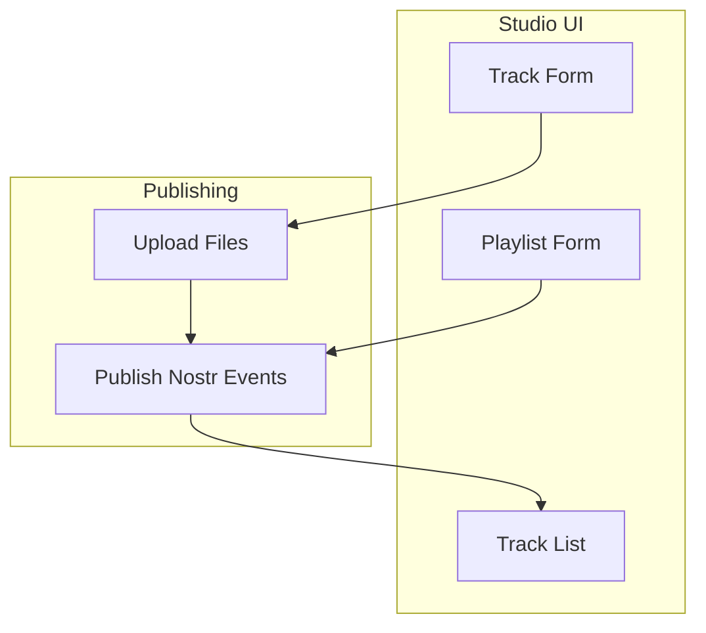

# Design Document

## Overview

This design transforms the music publishing workflow from a release-first approach to a track-first approach. Musicians publish individual tracks with complete metadata, then organize these tracks into playlists. The key insight is that if we publish the correct Nostr events (Kind 36787 for tracks, Kind 34139 for playlists), the existing app infrastructure will handle everything else automatically.

## Architecture

### Simplified Architecture



### Core Principle

**Publish correct Nostr events → Everything else works automatically**

The existing app already handles:
- Music discovery and display
- Audio playback
- Social features (zaps, comments, reposts)
- RSS feed generation
- Analytics and stats

We only need to focus on publishing the right event structure.

## Components and Interfaces

### Track Publishing

#### TrackForm Component
```typescript
interface TrackFormProps {
  onSubmit: (data: MusicTrackFormData) => Promise<void>;
  initialData?: Partial<MusicTrackFormData>;
}
```

**Simple form with:**
- Basic fields: title, artist, description
- File uploads: audio file, cover image
- Rich metadata: lyrics, credits
- Publish button

#### usePublishTrack Hook
```typescript
function usePublishTrack() {
  return useMutation({
    mutationFn: async (formData: MusicTrackFormData) => {
      // 1. Upload files
      const audioUrl = await uploadFile(formData.audioFile);
      const imageUrl = await uploadFile(formData.imageFile);
      
      // 2. Create Nostr event (Kind 36787)
      const event = createTrackEvent({
        ...formData,
        audioUrl,
        imageUrl
      });
      
      // 3. Publish event
      return await publishEvent(event);
    }
  });
}
```

### Playlist Publishing

#### PlaylistForm Component
```typescript
interface PlaylistFormProps {
  availableTracks: MusicTrackData[];
  onSubmit: (data: MusicPlaylistFormData) => Promise<void>;
  initialData?: Partial<MusicPlaylistFormData>;
}
```

**Simple form with:**
- Basic fields: title, description
- Track selection from user's published tracks
- Cover image upload
- Publish button

#### usePublishPlaylist Hook
```typescript
function usePublishPlaylist() {
  return useMutation({
    mutationFn: async (formData: MusicPlaylistFormData) => {
      // 1. Upload cover image if provided
      const imageUrl = await uploadFile(formData.imageFile);
      
      // 2. Create track references
      const trackRefs = formData.selectedTracks.map(track => ({
        kind: 36787,
        pubkey: track.artistPubkey,
        identifier: track.identifier
      }));
      
      // 3. Create Nostr event (Kind 34139)
      const event = createPlaylistEvent({
        ...formData,
        imageUrl,
        tracks: trackRefs
      });
      
      // 4. Publish event
      return await publishEvent(event);
    }
  });
}
```

### Studio Pages

#### /studio/tracks
- List of user's published tracks
- "New Track" button
- Edit/delete actions per track

#### /studio/playlists  
- List of user's playlists
- "New Playlist" button
- Edit/delete actions per playlist

## Data Models

### Simplified Data Models

The existing `MusicTrackData` and `MusicPlaylistData` types are already perfect. We just need to ensure the publishing hooks create the correct Nostr event structure.

#### Key Event Structures

**Track Event (Kind 36787):**
```json
{
  "kind": 36787,
  "content": "Track description",
  "tags": [
    ["d", "unique-track-identifier"],
    ["title", "Track Title"],
    ["artist", "Artist Name"],
    ["url", "https://audio-url.com/track.mp3", "audio/mpeg"],
    ["image", "https://cover-url.com/cover.jpg"],
    ["lyrics", "Track lyrics..."],
    ["credits", "Producer: John Doe"],
    ["genre", "rock"],
    ["language", "en"],
    ["explicit", "false"]
  ]
}
```

**Playlist Event (Kind 34139):**
```json
{
  "kind": 34139,
  "content": "Playlist description", 
  "tags": [
    ["d", "unique-playlist-identifier"],
    ["title", "Playlist Title"],
    ["image", "https://cover-url.com/playlist.jpg"],
    ["a", "36787:artist-pubkey:track-identifier-1"],
    ["a", "36787:artist-pubkey:track-identifier-2"],
    ["a", "36787:artist-pubkey:track-identifier-3"]
  ]
}
```

The `["a"]` tags reference tracks by their addressable event coordinates.

## Correctness Properties

*A property is a characteristic or behavior that should hold true across all valid executions of a system-essentially, a formal statement about what the system should do. Properties serve as the bridge between human-readable specifications and machine-verifiable correctness guarantees.*

Let me analyze the acceptance criteria to determine which ones are testable as properties:

<function_calls>
<invoke name="prework">
<parameter name="featureName">track-first-publishing

## Correctness Properties

*A property is a characteristic or behavior that should hold true across all valid executions of a system-essentially, a formal statement about what the system should do. Properties serve as the bridge between human-readable specifications and machine-verifiable correctness guarantees.*

### Core Publishing Properties

Property 1: Track events have correct structure
*For any* published track, the Nostr event should have kind 36787 and include required tags (d, title, artist, url)
**Validates: Requirements 1.3**

Property 2: Playlist events have correct structure  
*For any* published playlist, the Nostr event should have kind 34139 and include track references as "a" tags
**Validates: Requirements 4.4**

Property 3: Track references are valid
*For any* track added to a playlist, the playlist should contain an "a" tag with format "36787:pubkey:identifier"
**Validates: Requirements 4.2**

Property 4: File uploads complete before publishing
*For any* track with audio/image files, the files should be uploaded and URLs included in the event before publishing
**Validates: Requirements 1.2**

Property 5: Track metadata preservation
*For any* track update, all metadata fields should be preserved in the updated event
**Validates: Requirements 3.2**

Property 6: Playlist track ordering
*For any* playlist, the order of "a" tags should match the intended track order
**Validates: Requirements 6.2**

### Simplified Error Handling

**File Upload Failures:** Retry with user notification
**Publishing Failures:** Queue for retry when network recovers  
**Invalid Data:** Show validation errors on form fields

## Testing Strategy

### Property-Based Testing with fast-check

**Key Properties to Test:**
- Event structure validation (kinds, required tags)
- File upload completion before publishing
- Track reference format correctness
- Metadata preservation during updates

**Example Property Test:**
```typescript
fc.assert(fc.property(
  trackDataGenerator(),
  async (trackData) => {
    const event = await publishTrack(trackData);
    expect(event.kind).toBe(36787);
    expect(event.tags.find(t => t[0] === 'd')).toBeDefined();
    expect(event.tags.find(t => t[0] === 'title')).toBeDefined();
  }
), { numRuns: 100 });
```

### Unit Testing Focus

**Form Validation:** Required fields, file format validation
**Event Creation:** Correct tag structure, proper encoding
**File Upload Integration:** Upload completion, error handling