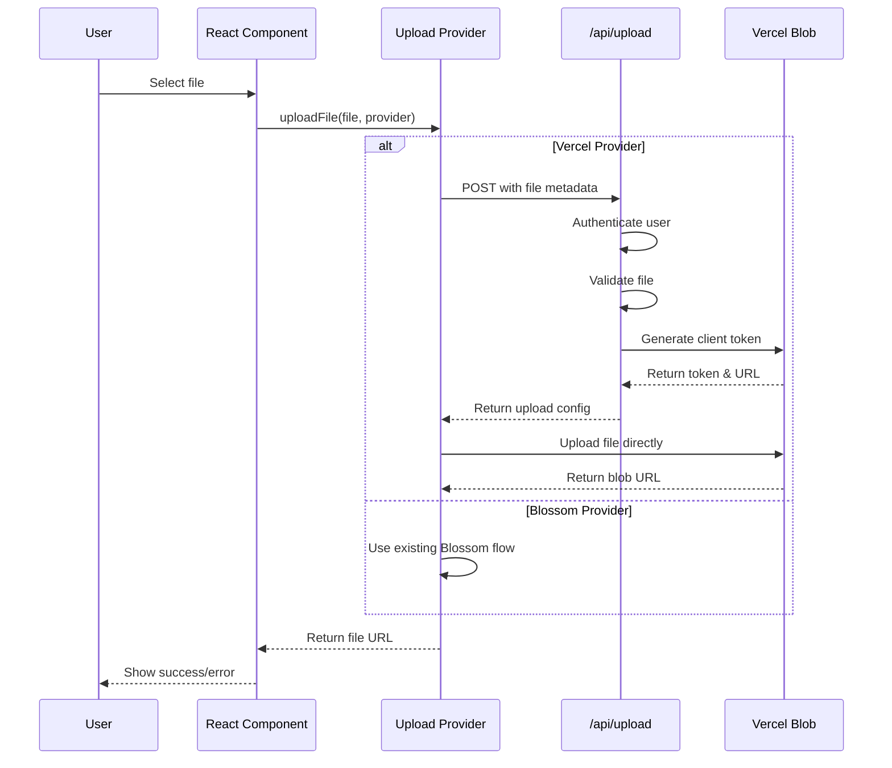

# Design Document: Vercel File Upload Integration

## Overview

This design implements Vercel Blob storage as an alternative file upload provider alongside the existing Blossom server infrastructure. The solution uses Vercel's client upload pattern with serverless functions for authentication and validation, providing a unified interface that maintains compatibility with existing components while offering improved performance and reliability.

The implementation follows Vercel's recommended client upload pattern, where files are uploaded directly from the browser to Vercel Blob storage through a secure authentication flow handled by serverless functions.

## Architecture

### High-Level Architecture

```mermaid
graph TB
    A[React Components] --> B[Upload Provider Interface]
    B --> C{Provider Selection}
    C -->|Blossom| D[Blossom Uploader]
    C -->|Vercel| E[Vercel Upload Client]
    
    E --> F[/api/upload Serverless Function]
    F --> G[Authentication & Validation]
    G --> H[Vercel Blob Storage]
    
    D --> I[Blossom Servers]
    
    J[Upload Configuration] --> B
    K[Local Storage] --> J
```

### Upload Flow Diagram



## Components and Interfaces

### 1. Upload Provider Interface

**Purpose**: Unified interface for all upload providers

```typescript
interface UploadProvider {
  name: 'blossom' | 'vercel';
  uploadFile(file: File): Promise<string>;
  validateFile(file: File): boolean;
  getMaxFileSize(): number;
  getSupportedTypes(): string[];
}
```

### 2. Vercel Upload Provider

**Purpose**: Implements Vercel Blob client upload pattern

**Key Features**:
- Client-side upload using `@vercel/blob/client`
- Authentication through `/api/upload` serverless function
- Progress tracking and error handling
- File validation before upload

### 3. Upload Configuration Manager

**Purpose**: Manages user preferences for upload providers

**Storage**: Local storage with fallback to defaults
**Interface**: Settings UI in Studio tab

### 4. Serverless Function (`/api/upload`)

**Purpose**: Handles authentication and generates upload tokens

**Responsibilities**:
- User authentication (Nostr signature verification)
- File validation (type, size, name sanitization)
- Generate Vercel Blob client tokens
- Rate limiting and security

## Data Models

### Upload Configuration

```typescript
interface UploadConfig {
  defaultProvider: 'blossom' | 'vercel';
  vercelEnabled: boolean;
  blossomEnabled: boolean;
  maxFileSize: number;
  allowedTypes: string[];
  fallbackEnabled: boolean;
}
```

### Upload Response

```typescript
interface UploadResponse {
  url: string;
  provider: 'blossom' | 'vercel';
  size: number;
  type: string;
  filename: string;
}
```

### Vercel Upload Request

```typescript
interface VercelUploadRequest {
  filename: string;
  contentType: string;
  size: number;
  userPubkey: string;
  signature: string;
}
```

## Implementation Details

### Vercel Blob Integration

**Client Upload Pattern**: Uses Vercel's recommended client upload approach where files go directly from browser to Vercel Blob after authentication.

**Authentication Flow**:
1. Client calls `/api/upload` with file metadata and Nostr signature
2. Server validates user and file parameters
3. Server generates client token using `handleUpload` from `@vercel/blob/client`
4. Client receives token and uploads directly to Vercel Blob
5. Vercel Blob returns public URL

**File Size Limits**:
- Client uploads: No practical limit (recommended for files > 4.5MB)
- Server uploads: 4.5MB limit (not used in this implementation)

### Security Measures

**Authentication**: Nostr signature verification ensures only authenticated users can upload

**File Validation**:
- MIME type validation against allowlist
- File size limits (configurable per provider)
- Filename sanitization to prevent path traversal
- Rate limiting to prevent abuse

**Token Security**: Client tokens are short-lived and scoped to specific uploads

### Error Handling

**Network Errors**: Exponential backoff retry for transient failures

**Validation Errors**: Clear error messages for invalid files

**Authentication Errors**: Proper error codes and user-friendly messages

**Fallback Strategy**: Optional fallback to alternative provider on failure

## Key Implementation Requirements

The system must satisfy these core requirements:

1. **Provider Abstraction**: Maintain consistent API interface regardless of upload provider
2. **File Validation**: Validate file types, sizes, and names before upload
3. **Authentication**: Secure uploads with Nostr signature verification
4. **Configuration Management**: Persist user provider preferences
5. **Error Handling**: Provide clear error messages and graceful failure handling

## Error Handling

### Error Categories

**Validation Errors**:
- Invalid file type or size
- Malformed filenames
- Missing required parameters

**Authentication Errors**:
- Invalid or missing Nostr signature
- Expired authentication tokens
- Insufficient permissions

**Network Errors**:
- Connection timeouts
- Service unavailability
- Rate limit exceeded

**Provider-Specific Errors**:
- Vercel Blob service errors
- Blossom server connectivity issues
- Storage quota exceeded

### Error Response Format

```typescript
interface UploadError {
  code: string;
  message: string;
  provider?: string;
  details?: Record<string, any>;
  retryable: boolean;
}
```

### Retry Strategy

**Exponential Backoff**: 1s, 2s, 4s, 8s maximum
**Max Retries**: 3 attempts for network errors
**Non-Retryable**: Authentication and validation errors

## Testing Strategy

### Basic Testing Approach

The implementation will use focused unit tests to verify core functionality:

**Unit Tests**: 
- Authentication flow with valid/invalid signatures
- File validation with common file types and sizes  
- Configuration persistence and retrieval
- Error handling for key failure scenarios
- Provider selection and routing logic

**Integration Tests**:
- End-to-end upload flow for both providers
- Configuration UI interactions
- Error boundary behavior

### Test Coverage Focus

Tests will focus on:
- Critical path functionality (successful uploads)
- Common error conditions (invalid files, auth failures)
- Configuration management
- Provider switching behavior

The testing approach prioritizes practical validation of core features over exhaustive property testing.